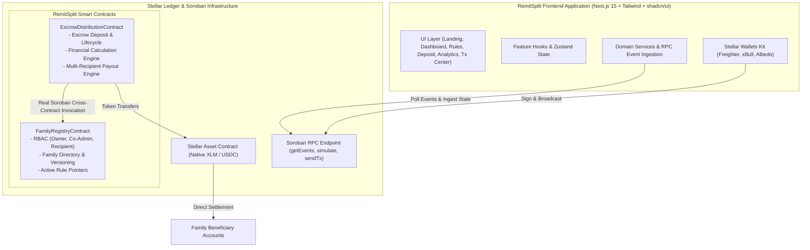
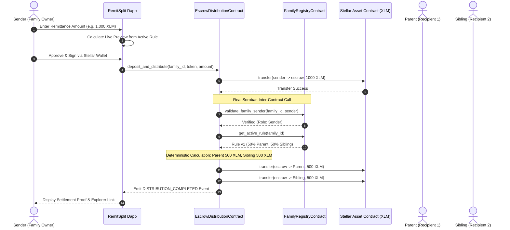
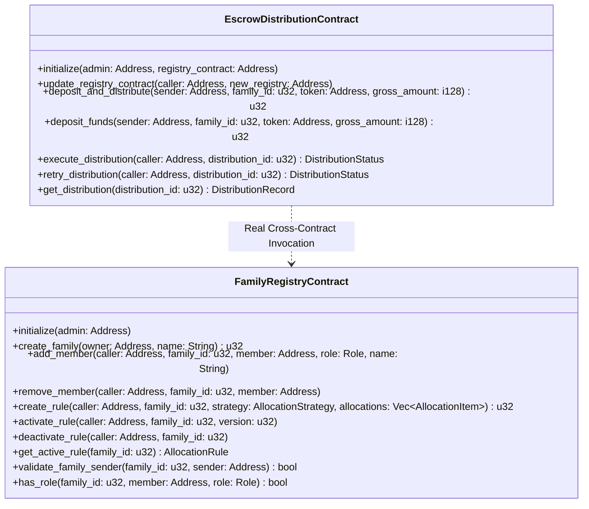
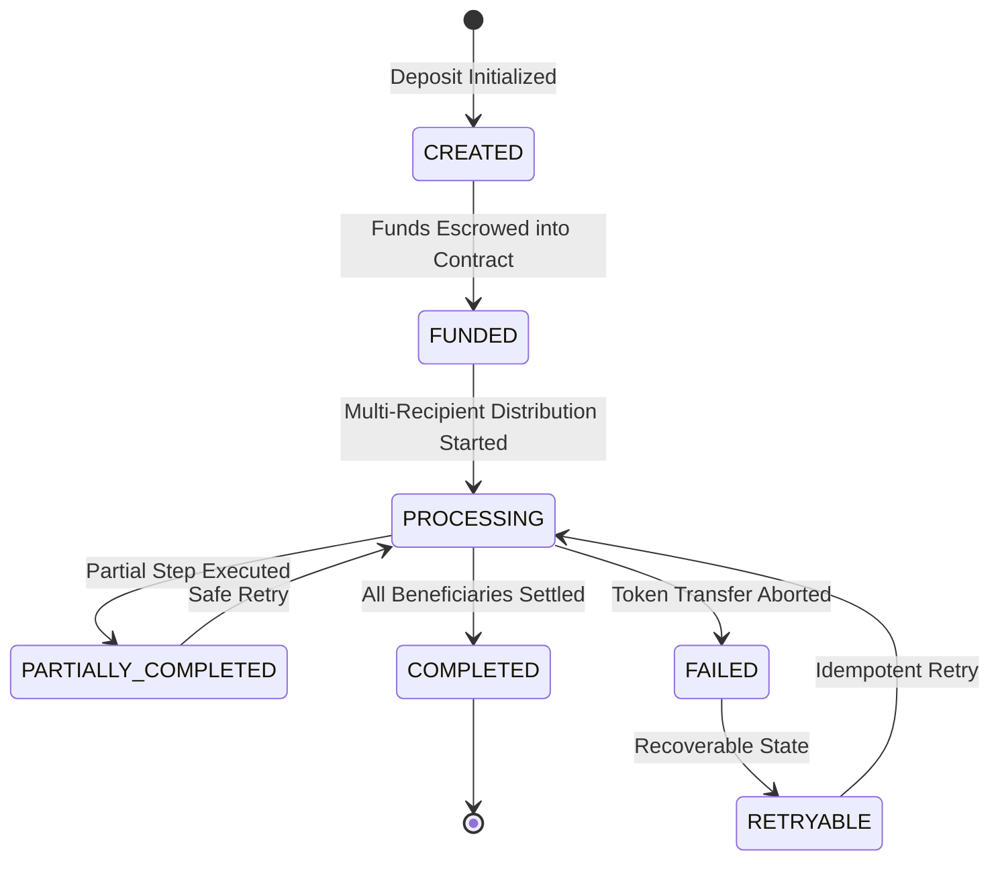
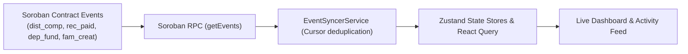

<div align="center">

  

  # RemitSplit

  **Programmable Cross-Border Remittance Splitting on Stellar**

  *Deposit once from anywhere in the world and automatically split funds among family members according to cryptographic, on-chain programmable allocation rules on Soroban.*

  <br />

  [](https://developers.stellar.org)
  [](https://soroban.stellar.org)
  [](https://nextjs.org)
  [](https://www.typescriptlang.org)
  [](https://github.com)

</div>

---

## 🌟 Executive Summary & Problem Statement

Cross-border family remittances commonly suffer from significant operational friction:
- **Repetitive manual transfers:** Senders (e.g., NRIs, overseas workers) must manually initiate separate wire transfers to parents, tuition accounts for siblings, and emergency reserves for dependents.
- **High cumulative transaction fees:** Multiple international transfers incur repeated fixed wire and foreign exchange fees.
- **Fragmented payment records & poor visibility:** Families struggle with inconsistent payment histories, delayed settlements, and opaque accounting.
- **Lack of automation & rules:** Senders cannot enforce algorithmic payout waterfalls or split percentages on remittances.

**RemitSplit** solves this on the **Stellar network** by combining fast, sub-cent native settlement with **Soroban smart contracts**. A sender makes **one single deposit**, and the RemitSplit protocol automatically evaluates the family's approved programmable rule and distributes funds directly to all beneficiary wallets with full cryptographic auditability and zero floating-point rounding errors.

---

## 🏛️ Overall System Architecture



---

## 🔄 Sequence Diagrams

### 1. Sender Deposit & Split Execution Sequence



### 2. Inter-Contract Call Architecture



---

## ⚡ Programmable Allocation Strategies

RemitSplit enforces **lossless integer arithmetic** (Stellar stroops: $1\text{ XLM} = 10^7\text{ stroops}$ and basis points: $100.00\% = 10{,}000\text{ bps}$).

| Strategy | Description | Example Calculation |
| :--- | :--- | :--- |
| **Percentage Split** | Allocates exact basis points across beneficiaries. Remainder from integer division is deterministically absorbed by the last recipient so that $\sum \text{payouts} \equiv \text{deposit}$. | Deposit: 1,000 XLM<br/>• Parents: 50% (5,000 bps) $\to$ 500 XLM<br/>• Sibling: 30% (3,000 bps) $\to$ 300 XLM<br/>• Dependent: 20% (2,000 bps) $\to$ 200 XLM |
| **Fixed Amount** | Enforces exact fixed Stellar stroop amounts. Total fixed targets are strictly verified against the gross deposit amount. | Deposit: 1,000 XLM<br/>• Parents: 600 XLM fixed<br/>• Sibling: 400 XLM fixed |
| **Priority Waterfall** | Sequential tier distribution where high-priority tiers are filled up to their cap first, and the terminal tier absorbs the entire remaining balance. | Deposit: 1,200 XLM<br/>1. Parents (Cap 500 XLM) $\to$ 500 XLM<br/>2. Sibling (Cap 300 XLM) $\to$ 300 XLM<br/>3. Dependent (Remainder) $\to$ 400 XLM |

---

## 🔒 Security Architecture & State Machine



### Security Guarantees
1. **On-Chain Role-Based Access Control (RBAC):**
   - `Sender (Owner)`: Can create rules, activate rules, remove members, and trigger distributions.
   - `CoAdmin`: Can add recipient beneficiaries and propose new rule versions, but cannot activate rules or withdraw escrow without owner authorization.
   - `Recipient`: Read-only permissions on group rules; receives funds directly to their address.
2. **Double-Execution & Replay Protection:** Payout tracking ensures already completed transfers cannot be executed twice during retries.
3. **Storage TTL Management:** Contract instances and persistent entries automatically bump time-to-live thresholds to ensure state retention across ledger epochs.

---

## 📡 Real-Time Blockchain Event Pipeline



---

## 📂 Repository Structure

```text
RemitSplit/
├── contracts/
│   ├── family-registry/               # FamilyRegistryContract (RBAC & Rule Versioning)
│   │   ├── src/
│   │   │   ├── types.rs               # Roles, Strategies, Family, AllocationRule
│   │   │   ├── storage.rs             # Persistent storage keys & TTL extensions
│   │   │   ├── errors.rs              # Contract errors
│   │   │   ├── events.rs              # Typed Soroban events
│   │   │   ├── lib.rs                 # Contract implementation
│   │   │   └── test.rs                # 5 comprehensive unit tests
│   │   └── Cargo.toml
│   └── escrow-distribution/           # EscrowDistributionContract (Escrow & Multi-payout)
│       ├── src/
│       │   ├── types.rs               # DistributionRecord, RecipientPayout, Status
│       │   ├── registry_client.rs     # Inter-contract client interface
│       │   ├── calculator.rs          # Deterministic integer math calculation engine
│       │   ├── storage.rs             # Distribution records & TTL management
│       │   ├── errors.rs              # Explicit contract errors
│       │   ├── events.rs              # Deposit & distribution events
│       │   ├── lib.rs                 # Contract implementation with cross-contract calls
│       │   └── test.rs                # 7 comprehensive unit & integration tests
│       └── Cargo.toml
├── src/
│   ├── app/                           # Next.js 15 App Router Pages
│   │   ├── layout.tsx                 # Root layout with QueryClient provider
│   │   ├── page.tsx                   # Startup landing page
│   │   ├── dashboard/page.tsx         # Remittance dashboard & live metrics
│   │   ├── families/page.tsx          # Family & member management + RBAC matrix
│   │   ├── rules/page.tsx             # Split rules directory & version switcher
│   │   ├── rules/builder/page.tsx     # Programmable rule builder with live validation
│   │   ├── deposit/page.tsx           # Deposit & split wizard
│   │   ├── transactions/page.tsx      # Transaction center with retry controls
│   │   ├── activity/page.tsx          # Real-time decoded activity feed
│   │   ├── analytics/page.tsx         # Financial trends & allocation charts
│   │   └── settings/page.tsx          # Network settings & observability diagnostics
│   ├── components/                    # UI & layout primitives (shadcn/ui style)
│   ├── features/                      # Feature modules & unit tests
│   ├── services/                      # Stellar RPC, contract clients, event syncer
│   ├── state/                         # Zustand state stores (Wallet, Family, Tx, Activity)
│   ├── types/                         # Strict TypeScript domain models
│   └── lib/                           # Formatters, utils, observability logger
├── scripts/
│   ├── build-contracts.sh             # Compiles & optimizes Soroban WASMs
│   ├── deploy-testnet.sh              # Deploys both contracts to Stellar Testnet
│   ├── init-contracts.sh              # Initializes contracts & wires dependencies
│   ├── seed-testnet-data.sh           # Seeds test family, members, and rules
│   └── verify-deployment.sh           # Verifies on-chain state via RPC
├── .github/workflows/ci.yml           # Automated CI/CD quality pipeline
├── Cargo.toml                         # Workspace Cargo configuration
├── package.json                       # Next.js & dependency configuration
├── tsconfig.json                      # Strict TypeScript configuration
└── tailwind.config.ts                 # Modern fintech design tokens
```

---

## 🚀 Getting Started (Local Development)

### Prerequisites
- Node.js 22+ & pnpm
- Rust 1.80+ with `wasm32-unknown-unknown` target
- Stellar CLI (`stellar` 27.0+)

### 1. Clone & Install Dependencies
```bash
git clone https://github.com/Zulekha01/RemitSplit.git
cd RemitSplit
pnpm install
```

### 2. Run Smart Contract Tests
```bash
cargo test --workspace
```
*Output: 12 passing tests covering family creation, RBAC authorization, rule versioning, percentage remainder determinism, fixed sums, waterfall priorities, inter-contract invocations, and retry safety.*

### 3. Build Contract WASM Artifacts
```bash
./scripts/build-contracts.sh
```

### 4. Run Frontend Unit & Integration Tests
```bash
pnpm test
```

### 5. Start Frontend Dapp
```bash
pnpm dev
```
Open [http://localhost:3000](http://localhost:3000) in your browser.

---

## 🌐 Testnet Deployment Guide

Deploy both Soroban contracts to the official Stellar Testnet using the automated scripts or manual commands:

### Automated Deployment
```bash
export STELLAR_NETWORK=testnet
export STELLAR_ACCOUNT=remitsplit-admin

# Deploy, initialize, and wire contract dependencies
./scripts/deploy-testnet.sh

# Optionally seed initial demo family
./scripts/seed-testnet-data.sh

# Verify deployment
./scripts/verify-deployment.sh
```

### Manual Stellar CLI Commands

#### 1. Create & Fund Testnet Identity
```bash
stellar keys generate remitsplit-admin --network testnet --fund
```

#### 2. Deploy FamilyRegistryContract
```bash
stellar contract deploy \
  --wasm target/wasm32v1-none/release/family_registry.wasm \
  --source-account remitsplit-admin \
  --network testnet
```

#### 3. Deploy EscrowDistributionContract
```bash
stellar contract deploy \
  --wasm target/wasm32v1-none/release/escrow_distribution.wasm \
  --source-account remitsplit-admin \
  --network testnet
```

#### 4. Initialize Contracts
```bash
# Initialize FamilyRegistryContract
stellar contract invoke \
  --id <FAMILY_REGISTRY_CONTRACT_ID> \
  --source-account remitsplit-admin \
  --network testnet \
  -- \
  initialize \
  --admin $(stellar keys address remitsplit-admin)

# Initialize EscrowDistributionContract with linked FamilyRegistry address
stellar contract invoke \
  --id <ESCROW_DISTRIBUTION_CONTRACT_ID> \
  --source-account remitsplit-admin \
  --network testnet \
  -- \
  initialize \
  --admin $(stellar keys address remitsplit-admin) \
  --registry_contract <FAMILY_REGISTRY_CONTRACT_ID>
```

---

## 📜 Contract Addresses & Testnet Transactions

### Live Testnet Deployments

| Component | Identifier / Address | Explorer Link |
| :--- | :--- | :--- |
| **Family Registry Contract** | `CCOJB3FIN3CCNBCJNUK62FW44V7EG3A6P7WVIEBUW5LBA23LZM7275XD` | [View Registry on StellarExpert](https://stellar.expert/explorer/testnet/contract/CCOJB3FIN3CCNBCJNUK62FW44V7EG3A6P7WVIEBUW5LBA23LZM7275XD) |
| **Escrow Distribution Contract** | `CBDWDKUVAW2U4THOHADINH3GDVUTEYZZPI6LADORKL3EUCHRZ7G2JL72` | [View Escrow on StellarExpert](https://stellar.expert/explorer/testnet/contract/CBDWDKUVAW2U4THOHADINH3GDVUTEYZZPI6LADORKL3EUCHRZ7G2JL72) |
| **Native XLM SAC** | `CDLZFC3SYJYDZT7K67VZ75HPJVIEUVNIXF47ZG2FB2RMQQVU2HHGCYSC` | [View SAC on StellarExpert](https://stellar.expert/explorer/testnet/contract/CDLZFC3SYJYDZT7K67VZ75HPJVIEUVNIXF47ZG2FB2RMQQVU2HHGCYSC) |

### Verified On-Chain Transactions (Stellar Testnet)

| Operation | Transaction Hash | Ledger | Status |
| :--- | :--- | :--- | :--- |
| **Registry Contract Init** | [`e057aa35bbac22ad...`](https://stellar.expert/explorer/testnet/tx/e057aa35bbac22ad923c8aae2ac4ed9eeff15f1bb244ecd7229d0a80805192b6) | 4435288 | Confirmed |
| **Escrow Contract Init** | [`c83d57885eb75ad5...`](https://stellar.expert/explorer/testnet/tx/c83d57885eb75ad551aae809c701ca9d915cf7c74526a21df939428dd066a7b8) | 4435290 | Confirmed |
| **Create Family (Aalmi Group)** | [`38a736f3ea798957...`](https://stellar.expert/explorer/testnet/tx/38a736f3ea7989575cd45cca403ad5420448ed25a7e5f7abf9223c441ef2c5ae) | 4435307 | Confirmed |
| **Add Member (Sister Co-Admin)** | [`3a1ccf30f2945ad7...`](https://stellar.expert/explorer/testnet/tx/3a1ccf30f2945ad72b3fb09ae31ab15da640b7d0f4c32a93ab604befd5e541fd) | 4435309 | Confirmed |
| **Add Member (Mother Recipient)** | [`745e118c1a26c30f...`](https://stellar.expert/explorer/testnet/tx/745e118c1a26c30f41c3444bdf2df555894201eb57fdfec23497029fb331aefa) | 4435312 | Confirmed |
| **Create Split Rule v1 (50/50)** | [`2c6cae3683d85434...`](https://stellar.expert/explorer/testnet/tx/2c6cae3683d854340696483ad4225f8cdf07352e1505717287780a423e496b73) | 4435315 | Confirmed |
| **Activate Rule Version 1** | [`67c72501e9a135a7...`](https://stellar.expert/explorer/testnet/tx/67c72501e9a135a7563a6b3db2de4c7ab5c2bc9e6754fc4bb204d63e1c5bedcb) | 4435318 | Confirmed |
| **Deposit & Atomic Split** | [`7fe7159c3f618393...`](https://stellar.expert/explorer/testnet/tx/7fe7159c3f618393fca6f76970410f20b195245504a3c7a8f07f2d7c081691ca) | 4435322 | Confirmed |

> [!NOTE]
> When executing `./scripts/deploy-testnet.sh`, the newly deployed contract IDs are automatically configured into `.env.local` and `.env.example`.

---

## 🗺️ Roadmap & Future Enhancements

- [ ] **USDC & Stablecoin Expansion:** Multi-asset escrow support for USDC on Stellar.
- [ ] **Stellar Anchor Off-Ramping (SEP-24 / SEP-38):** Direct local fiat cash payouts via MoneyGram and regional anchors.
- [ ] **Recurring Remittance Schedules:** Automated recurring deposits via Soroban cron hooks.
- [ ] **Multi-Signature Rule Approvals:** Require co-admin consensus before updating high-value allocation rules.

---

## 📄 License

MIT License &copy; 2026 RemitSplit Contributors.
