<p align="center">
  
</p>

<p align="center">
  <strong>RemitSplit — Programmable Cross-Border Remittance Splitting on Stellar</strong><br/>
  <em>A decentralized protocol enabling senders to deposit once from anywhere in the world and automatically split funds among family members according to cryptographic, on-chain programmable allocation rules on Soroban.</em>
</p>

<p align="center">
  <a href="https://remitsplit.vercel.app"></a>
  <a href="https://stellar.expert/explorer/testnet/contract/CASNMT6EHJFZHCVK3O7N253ANI3FG2AABPS7DT6QGWZRBKKFTVR5XC7V"></a>
  <a href="https://stellar.expert/explorer/testnet/contract/CAQRTZ55VOZPSW5266EQVSAIRKRVZCEC4AIIRQOL3R7MAUNZXIFGS3YM"></a>
  <a href="https://stellar.expert/explorer/testnet/contract/CDLZFC3SYJYDZT7K67VZ75HPJVIEUVNIXF47ZG2FB2RMQQVU2HHGCYSC"></a>
  
  
</p>

---

## Table of Contents

- [1. Product Overview & Problem Statement](#1-product-overview--problem-statement)
- [2. Architecture](#2-architecture)
  - [2.1 Role Hierarchy & Permissions Model](#21-role-hierarchy--permissions-model)
  - [2.2 Inter-Contract Verification & Atomic Split Flow](#22-inter-contract-verification--atomic-split-flow)
- [3. Smart Contract Design](#3-smart-contract-design)
  - [3.1 FamilyRegistry](#31-familyregistry)
  - [3.2 EscrowDistribution](#32-escrowdistribution)
  - [3.3 Role-Based Access Control (RBAC)](#33-role-based-access-control-rbac)
  - [3.4 Programmable Allocation Strategies](#34-programmable-allocation-strategies)
- [4. Inter-Contract Communication & Sequence](#4-inter-contract-communication--sequence)
- [5. Features & Tech Stack](#5-features--tech-stack)
- [6. Local Development Setup](#6-local-development-setup)
- [7. CI/CD & Deployment](#7-cicd--deployment)
  - [7.1 Automated CI & Testing (Pull Requests & Pushes)](#71-automated-ci--testing-pull-requests--pushes)
  - [7.2 Automated Deploy (merge to main)](#72-automated-deploy-merge-to-main)
  - [7.3 Contract Deployment & Seed (Testnet)](#73-contract-deployment--seed-testnet)
- [8. Security Considerations](#8-security-considerations)
- [9. Screenshots](#9-screenshots)
  - [9.1 Desktop](#91-desktop)
  - [9.2 Mobile](#92-mobile)
  - [9.3 Test](#93-test)
  - [9.4 CI/CD](#94-cicd)
- [10. Contract Addresses & On-Chain Verification](#10-contract-addresses--on-chain-verification)
- [11. Resources & Links](#11-resources--links)
- [Contributing](#contributing)
- [License](#license)

---

## 1. Product Overview & Problem Statement

Cross-border family remittances commonly suffer from significant operational friction, repeated transfer fees, and zero programmability:

| Pain Point | RemitSplit On-Chain Solution |
|---|---|
| **Repetitive manual transfers** | Single-deposit execution automatically divided across parents, education funds, and emergency accounts |
| **Compounding wire & FX fees** | 1 atomic on-chain transaction replaces 3–5 separate wires; Stellar sub-cent fees (<0.0001 XLM) |
| **Fragmented records & disputes** | Real-time on-chain settlement ledger with immutable Soroban RPC event emissions |
| **Unenforced payout ratios** | Cryptographically enforced split rules (Percentage, Fixed Amount, Priority Waterfall) |
| **Custodial counterparty risk** | Non-custodial escrow architecture; funds route directly to beneficiary self-custody wallets |
| **Lossy floating-point math** | 100% integer arithmetic using Stellar stroops (10^7) and basis points (10,000 bps) |

**RemitSplit** combines Stellar high-throughput payment rails with **Soroban smart contracts** on Stellar Testnet. Senders sign in-browser using **StellarWalletsKit** (Freighter, xBull, Albedo) or the built-in **In-App Testnet Signer**. Funds are deposited into escrow and immediately dispatched to registered beneficiary accounts in a single atomic transaction.

---

## 2. Architecture

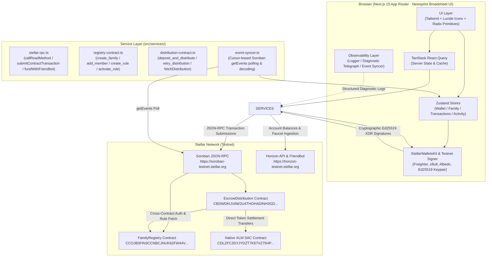
```mermaid
graph TD
    subgraph Browser["Browser (Next.js 15 App Router · Newsprint Broadsheet UI)"]
        UI["UI Layer\n(Tailwind + Lucide Icons + Radix Primitives)"]
        RQ["TanStack React Query\n(Server State & Cache)"]
        ZS["Zustand Stores\n(Wallet / Family / Transactions / Activity)"]
        SWK["StellarWalletsKit & Testnet Signer\n(Freighter, xBull, Albedo, Ed25519 Keypair)"]
        OBS["Observability Layer\n(Logger / Diagnostic Telegraph / Event Syncer)"]
    end

    subgraph Services["Service Layer (src/services/)"]
        RPC_SRV["stellar-rpc.ts\n(callReadMethod / submitContractTransaction / fundWithFriendbot)"]
        REG_SRV["registry-contract.ts\n(create_family / add_member / create_rule / activate_rule)"]
        DIST_SRV["distribution-contract.ts\n(deposit_and_distribute / retry_distribution / fetchDistribution)"]
        EVENT_SRV["event-syncer.ts\n(Cursor-based Soroban getEvents polling & decoding)"]
    end

    subgraph Stellar["Stellar Network (Testnet)"]
        SOROBAN_RPC["Soroban JSON-RPC\nhttps://soroban-testnet.stellar.org"]
        HORIZON["Horizon API & Friendbot\nhttps://horizon-testnet.stellar.org"]
        FR["FamilyRegistry Contract\nCCOJB3FIN3CCNBCJNUK62FW44V..."]
        ED["EscrowDistribution Contract\nCBDWDKUVAW2U4THOHADINH3GD..."]
        SAC["Native XLM SAC Contract\nCDLZFC3SYJYDZT7K67VZ75HP..."]
    end

    UI --> RQ
    UI --> ZS
    ZS --> SWK
    RQ --> SERVICES
    SERVICES --> SWK
    SWK -->|"Cryptographic Ed25519 XDR Signatures"| SERVICES
    SERVICES -->|"JSON-RPC Transaction Submissions"| SOROBAN_RPC
    SERVICES -->|"Account Balances & Faucet Ingestion"| HORIZON
    SOROBAN_RPC --> FR
    SOROBAN_RPC --> ED
    ED -->|"Cross-Contract Auth & Rule Fetch"| FR
    ED -->|"Direct Token Settlement Transfers"| SAC
    EVENT_SRV -->|"getEvents Poll"| SOROBAN_RPC
    EVENT_SRV --> ZS
    OBS -.->|"Structured Diagnostic Logs"| SERVICES
```

### 2.1 Role Hierarchy & Permissions Model

RemitSplit establishes an on-chain Role-Based Access Control (RBAC) matrix within `FamilyRegistryContract`:

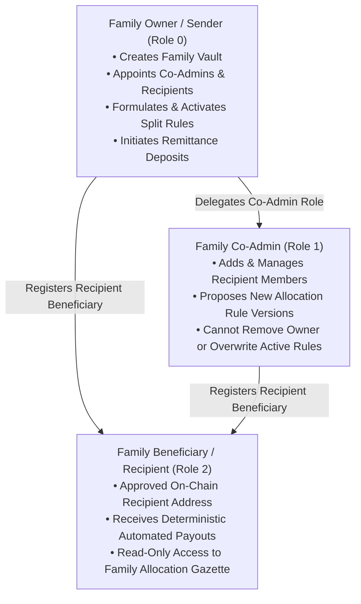
```mermaid
graph TD
    OWNER["Family Owner / Sender (Role 0)\n• Creates Family Vault\n• Appoints Co-Admins & Recipients\n• Formulates & Activates Split Rules\n• Initiates Remittance Deposits"]
    COADMIN["Family Co-Admin (Role 1)\n• Adds & Manages Recipient Members\n• Proposes New Allocation Rule Versions\n• Cannot Remove Owner or Overwrite Active Rules"]
    RECIPIENT["Family Beneficiary / Recipient (Role 2)\n• Approved On-Chain Recipient Address\n• Receives Deterministic Automated Payouts\n• Read-Only Access to Family Allocation Gazette"]

    OWNER -->|"Delegates Co-Admin Role"| COADMIN
    OWNER -->|"Registers Recipient Beneficiary"| RECIPIENT
    COADMIN -->|"Registers Recipient Beneficiary"| RECIPIENT
```

### 2.2 Inter-Contract Verification & Atomic Split Flow

When a sender triggers `deposit_and_distribute`, the `EscrowDistributionContract` enforces safety via cross-contract calls to `FamilyRegistryContract` before moving any funds:

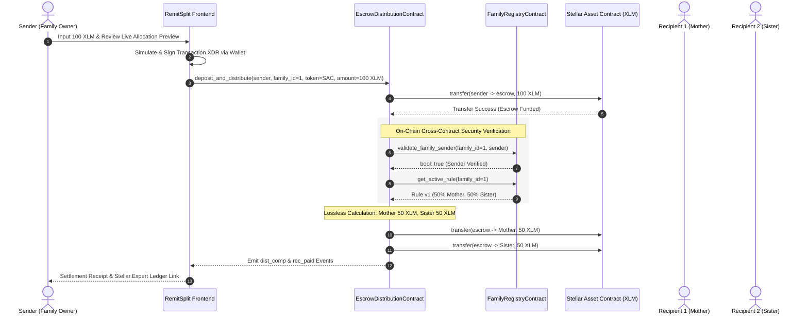
```mermaid
sequenceDiagram
    autonumber
    actor Sender as Sender (Family Owner)
    participant DAPP as RemitSplit Frontend
    participant ED as EscrowDistributionContract
    participant FR as FamilyRegistryContract
    participant SAC as Stellar Asset Contract (XLM)
    actor R1 as Recipient 1 (Mother)
    actor R2 as Recipient 2 (Sister)

    Sender->>DAPP: Input 100 XLM & Review Live Allocation Preview
    DAPP->>DAPP: Simulate & Sign Transaction XDR via Wallet
    DAPP->>ED: deposit_and_distribute(sender, family_id=1, token=SAC, amount=100 XLM)
    ED->>SAC: transfer(sender -> escrow, 100 XLM)
    SAC-->>ED: Transfer Success (Escrow Funded)
    
    rect rgb(245, 245, 245)
        Note over ED,FR: On-Chain Cross-Contract Security Verification
        ED->>FR: validate_family_sender(family_id=1, sender)
        FR-->>ED: bool: true (Sender Verified)
        ED->>FR: get_active_rule(family_id=1)
        FR-->>ED: Rule v1 (50% Mother, 50% Sister)
    end

    Note over ED: Lossless Calculation: Mother 50 XLM, Sister 50 XLM
    ED->>SAC: transfer(escrow -> Mother, 50 XLM)
    ED->>SAC: transfer(escrow -> Sister, 50 XLM)
    ED-->>DAPP: Emit dist_comp & rec_paid Events
    DAPP-->>Sender: Settlement Receipt & Stellar.Expert Ledger Link
```

---

## 3. Smart Contract Design

### 3.1 FamilyRegistry

**Purpose**: Master directory for family vaults, role assignments (RBAC), and programmable rule version archives.

**Address**: [`CASNMT6EHJFZHCVK3O7N253ANI3FG2AABPS7DT6QGWZRBKKFTVR5XC7V`](https://stellar.expert/explorer/testnet/contract/CASNMT6EHJFZHCVK3O7N253ANI3FG2AABPS7DT6QGWZRBKKFTVR5XC7V)

#### Storage Model

| Key | Storage Tier | Type | Description |
|---|---|---|---|
| `Admin` | Instance | `Address` | Platform bootstrap administrator |
| `FamilyCount` | Persistent | `u32` | Total auto-incrementing families registered |
| `Family(family_id)` | Persistent | `Family` | Family metadata (`id`, `name`, `owner`, `active_rule_version`, `created_at`) |
| `Member(family_id, address)` | Persistent | `Member` | Member record (`address`, `role`, `name`, `joined_at`) |
| `MemberList(family_id)` | Persistent | `Vec<Address>` | Ordered beneficiary roster |
| `RuleCount(family_id)` | Persistent | `u32` | Historical rule version counter |
| `Rule(family_id, version)` | Persistent | `AllocationRule` | Versioned rule definition (`strategy`, `allocations`, `active`, `created_by`) |

#### Public Functions

`initialize` · `create_family` · `add_member` · `remove_member` · `create_rule` · `activate_rule` · `deactivate_rule` · `get_family` · `get_members` · `get_rule` · `get_active_rule` · `validate_family_sender` · `has_role`

#### Events Emitted

| Symbol | Topic | Data |
|---|---|---|
| `fam_creat` | `(fam_creat, family_id, owner)` | `name` |
| `mbr_added` | `(mbr_added, family_id, member)` | `role` |
| `mbr_remvd` | `(mbr_remvd, family_id, member)` | `caller` |
| `rul_creat` | `(rul_creat, family_id, version)` | `strategy` |
| `rul_act` | `(rul_act, family_id, version)` | `caller` |
| `rul_deact` | `(rul_deact, family_id)` | `caller` |

---

### 3.2 EscrowDistribution

**Purpose**: Non-custodial escrow deposit holding, cross-contract rule resolution, deterministic payout calculation, and multi-recipient SAC settlement transfers.

**Address**: [`CAQRTZ55VOZPSW5266EQVSAIRKRVZCEC4AIIRQOL3R7MAUNZXIFGS3YM`](https://stellar.expert/explorer/testnet/contract/CAQRTZ55VOZPSW5266EQVSAIRKRVZCEC4AIIRQOL3R7MAUNZXIFGS3YM)

#### Storage Model

| Key | Storage Tier | Type | Description |
|---|---|---|---|
| `Admin` | Instance | `Address` | Protocol administrator |
| `RegistryContract` | Instance | `Address` | Linked `FamilyRegistry` contract address |
| `DistributionCount` | Persistent | `u32` | Total distribution operations recorded |
| `Distribution(dist_id)` | Persistent | `DistributionRecord` | Record storing depositor, gross amount, distributed amount, status, and payout vector |
| `FamilyDistributions(family_id)` | Persistent | `Vec<u32>` | List of distribution IDs per family vault |

#### Public Functions

`initialize` · `update_registry_contract` · `get_registry_contract` · `deposit_and_distribute` · `deposit_funds` · `execute_distribution` · `retry_distribution` · `get_distribution` · `get_distribution_count` · `get_family_distributions`

#### Events Emitted

| Symbol | Topic | Data |
|---|---|---|
| `dep_creat` | `(dep_creat, dist_id, family_id)` | `(sender, gross_amount)` |
| `dep_fund` | `(dep_fund, dist_id, family_id)` | `gross_amount` |
| `dist_start` | `(dist_start, dist_id, family_id)` | `recipient_count` |
| `rec_paid` | `(rec_paid, dist_id, recipient)` | `amount` |
| `dist_comp` | `(dist_comp, dist_id, family_id)` | `total_distributed` |
| `dist_part` | `(dist_part, dist_id, family_id)` | `distributed_so_far` |
| `dist_fail` | `(dist_fail, dist_id, family_id)` | `error_code` |

---

### 3.3 Role-Based Access Control (RBAC)

| Action | Sender (Owner) | Co-Admin | Recipient |
|---|:---:|:---:|:---:|
| **Create Family Vault** | Yes | No | No |
| **Add Recipient Beneficiary** | Yes | Yes | No |
| **Add Co-Admin** | Yes | No | No |
| **Remove Member** | Yes | Only Recipients | No |
| **Remove Owner** | Blocked on-chain | Blocked on-chain | Blocked on-chain |
| **Propose Rule Version** | Yes | Yes | No |
| **Activate Split Rule** | Yes | No | No |
| **Execute Deposit & Split** | Yes | No | No |
| **Retry Failed Payout** | Yes | Yes | No |
| **Inspect On-Chain Ledger** | Yes | Yes | Yes |

---

### 3.4 Programmable Allocation Strategies

RemitSplit enforces **lossless integer arithmetic** using Stellar stroops (1 XLM = 10,000,000 stroops) and basis points (100.00% = 10,000 bps):

| Strategy | Algorithmic Rule | Practical Remittance Example |
|---|---|---|
| **Percentage Split** | Allocates exact basis points across beneficiaries. Remainder from integer division is deterministically absorbed by the last recipient so that sum(payouts) equals deposit. | Deposit: 1,000 XLM<br/>• Mother: 50% (5,000 bps) -> 500 XLM<br/>• Sister: 30% (3,000 bps) -> 300 XLM<br/>• Brother: 20% (2,000 bps) -> 200 XLM |
| **Fixed Amount** | Enforces exact fixed Stellar stroop amounts. Total fixed targets are strictly verified against the gross deposit amount. | Deposit: 1,000 XLM<br/>• Tuition: 600 XLM fixed<br/>• Healthcare: 400 XLM fixed |
| **Priority Waterfall** | Sequential tier distribution where high-priority tiers are filled up to their cap first, and the terminal tier absorbs the entire remaining balance. | Deposit: 1,200 XLM<br/>1. Rent (Cap 500 XLM) -> 500 XLM<br/>2. School (Cap 300 XLM) -> 300 XLM<br/>3. Savings (Remainder) -> 400 XLM |

---

## 4. Inter-Contract Communication & Sequence

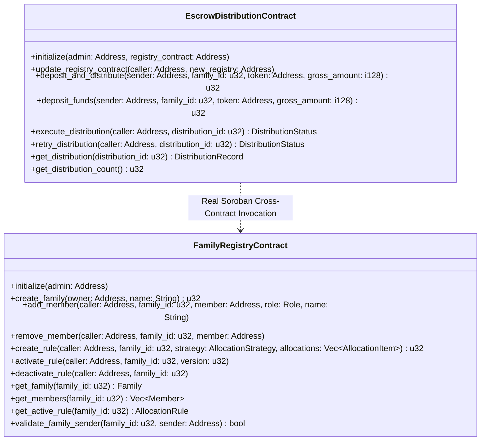
```mermaid
classDiagram
    class FamilyRegistryContract {
        +initialize(admin: Address)
        +create_family(owner: Address, name: String) u32
        +add_member(caller: Address, family_id: u32, member: Address, role: Role, name: String)
        +remove_member(caller: Address, family_id: u32, member: Address)
        +create_rule(caller: Address, family_id: u32, strategy: AllocationStrategy, allocations: Vec~AllocationItem~) u32
        +activate_rule(caller: Address, family_id: u32, version: u32)
        +deactivate_rule(caller: Address, family_id: u32)
        +get_family(family_id: u32) Family
        +get_members(family_id: u32) Vec~Member~
        +get_active_rule(family_id: u32) AllocationRule
        +validate_family_sender(family_id: u32, sender: Address) bool
    }

    class EscrowDistributionContract {
        +initialize(admin: Address, registry_contract: Address)
        +update_registry_contract(caller: Address, new_registry: Address)
        +deposit_and_distribute(sender: Address, family_id: u32, token: Address, gross_amount: i128) u32
        +deposit_funds(sender: Address, family_id: u32, token: Address, gross_amount: i128) u32
        +execute_distribution(caller: Address, distribution_id: u32) DistributionStatus
        +retry_distribution(caller: Address, distribution_id: u32) DistributionStatus
        +get_distribution(distribution_id: u32) DistributionRecord
        +get_distribution_count() u32
    }

    EscrowDistributionContract ..> FamilyRegistryContract : Real Soroban Cross-Contract Invocation
```

---

## 5. Features & Tech Stack

- **Framework**: Next.js 15 (App Router, Server & Client Components)
- **Language**: TypeScript Strict Mode & Rust (2021 edition, `wasm32-unknown-unknown`)
- **Smart Contracts**: Stellar Soroban SDK (`soroban-sdk = "22.0.0"`)
- **Client SDKs**: `@stellar/stellar-sdk` & `@creit.tech/stellar-wallets-kit`
- **State Management**: Zustand stores with `localStorage` persistent caching
- **UI Styling**: Tailwind CSS, Radix UI Primitives, Lucide Icons, Newsprint editorial aesthetic
- **Testing**: Rust cargo unit tests (12 tests) + Vitest frontend test runner (19 tests)
- **CI/CD**: GitHub Actions quality pipeline with automated PR validation, typecheck, and test suites

---

## 6. Local Development Setup

### Prerequisites
- Node.js 22+ & pnpm
- Rust 1.80+ with `wasm32-unknown-unknown` target
- Stellar CLI (`stellar` 27.0+)

### 1. Clone & Install Dependencies
```bash
git clone https://github.com/Zulekha01/RemitSplit.git
cd RemitSplit
pnpm install
```

### 2. Run Smart Contract Tests
```bash
cargo test --workspace
```
*Result: 12 passing tests covering family creation, RBAC authorization, rule versioning, percentage remainder determinism, fixed sums, waterfall priorities, inter-contract invocations, and retry safety.*

### 3. Build Contract WASM Artifacts
```bash
./scripts/build-contracts.sh
```

### 4. Run Frontend Unit & Store Tests
```bash
pnpm test
```
*Result: 19 passing tests covering rule formulation, address formatters, transaction lifecycle, and store state synchronization.*

### 5. Start Development Server
```bash
pnpm dev
```
Open [http://localhost:3000](http://localhost:3000) in your browser.

---

## 7. CI/CD & Deployment

### 7.1 Automated CI & Testing (Pull Requests & Pushes)

GitHub Actions workflow [`.github/workflows/ci.yml`](.github/workflows/ci.yml) executes on every push and pull request:
1. **Rust Smart Contracts**: Installs Rust toolchain, audits formatting, runs `cargo clippy`, and executes `cargo test --workspace`.
2. **Frontend Quality**: Verifies ESLint, TypeScript typecheck (`tsc --noEmit`), and Vitest test suite (`pnpm test`).
3. **Production Build**: Compiles optimized Next.js build (`pnpm build`) with all 15 static routes generated.

### 7.2 Automated Deploy (merge to main)

Merges to `main` branch trigger deployment checks ensuring WASM compilation integrity and zero dependency regressions.

### 7.3 Contract Deployment & Seed (Testnet)

```bash
export STELLAR_NETWORK=testnet
export STELLAR_ACCOUNT=remitsplit_deployer

# 1. Deploy both contracts
./scripts/deploy-testnet.sh

# 2. Seed initial demo family, members, and rules
./scripts/seed-testnet-data.sh

# 3. Verify on-chain deployment
./scripts/verify-deployment.sh
```

---

## 8. Security Considerations

1. **Deterministic Lossless Math**: All calculations operate on integer stroops (10^7). In percentage distributions, integer truncation remainders are absorbed by the final recipient to ensure sum(payouts) equals deposit to the exact stroop.
2. **Reentrancy & Double-Execution Guard**: The distribution state machine transitions through `Created` -> `Funded` -> `Processing` -> `Completed`. Payout flags on individual recipients prevent duplicate payouts during retries.
3. **Owner Removal Protection**: `FamilyRegistryContract` strictly prohibits removing the family creator/owner address (`ContractError::CannotRemoveOwner`).
4. **Isolated Dual-Signer Pipeline**: Transactions can be signed via official browser extensions (Freighter, xBull, Albedo) or generated testnet keypairs. Private keys are never transmitted over network RPCs.
5. **State Retention TTL Extension**: Contract instances and persistent data keys extend their ledger time-to-live thresholds dynamically during contract invocations.

---

## 9. Screenshots

### 9.1 Desktop Interface

| Landing Hero Broadsheet | Deterministic Split Strategies |
|:---:|:---:|
| 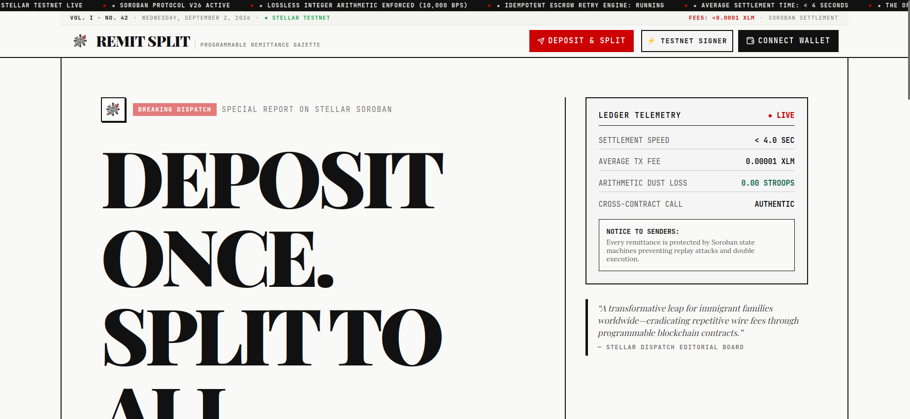 | 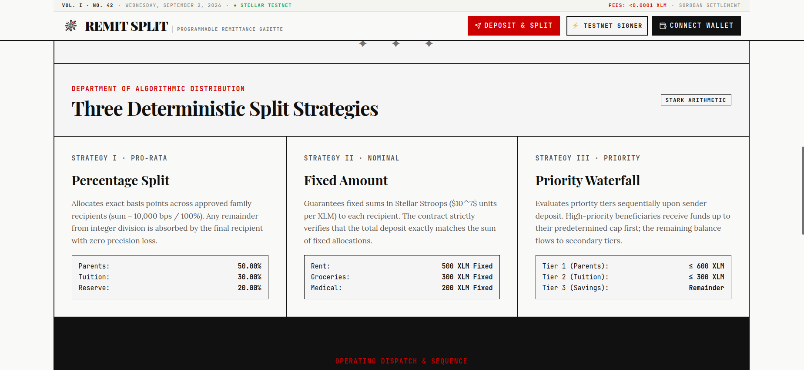 |

| Protocol Dispatch & Action | Family Roster & Member Directory |
|:---:|:---:|
| 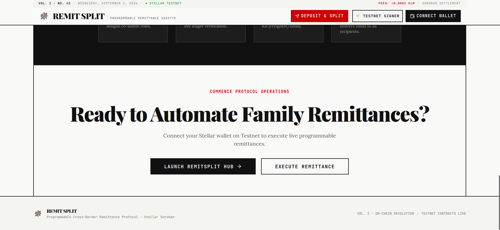 | 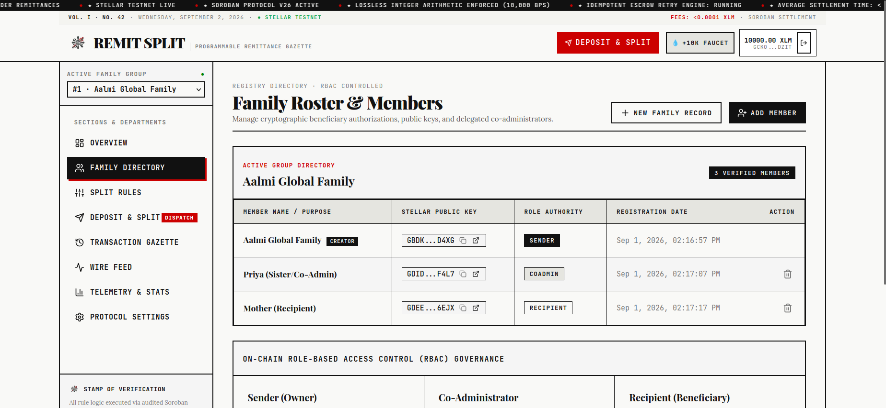 |

| On-Chain RBAC Governance | Family Hub & Overview Gazette |
|:---:|:---:|
| 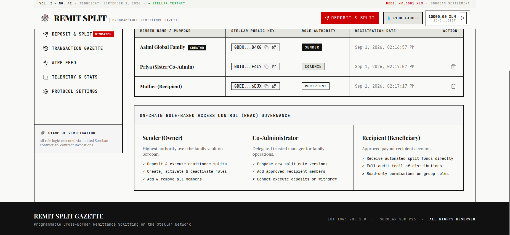 | 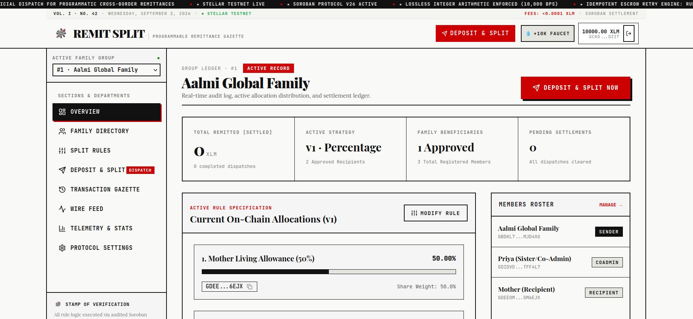 |

| Telemetry & Financial Reports | Rule Version Archive |
|:---:|:---:|
| 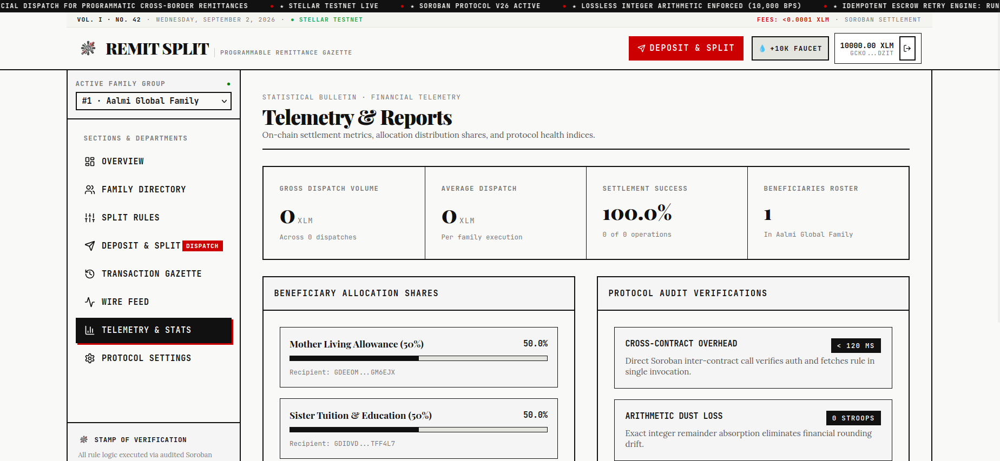 | 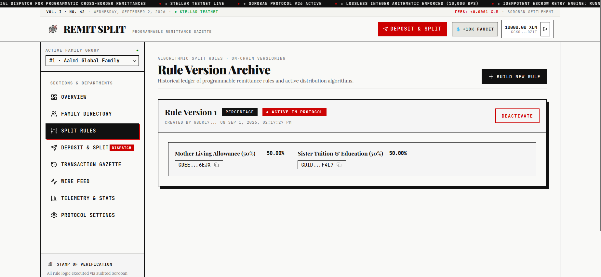 |

| Deposit & Atomic Split Workflow | Register Family Record Modal |
|:---:|:---:|
| 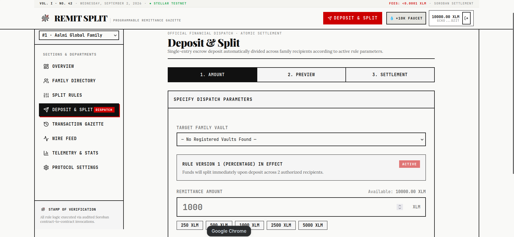 | 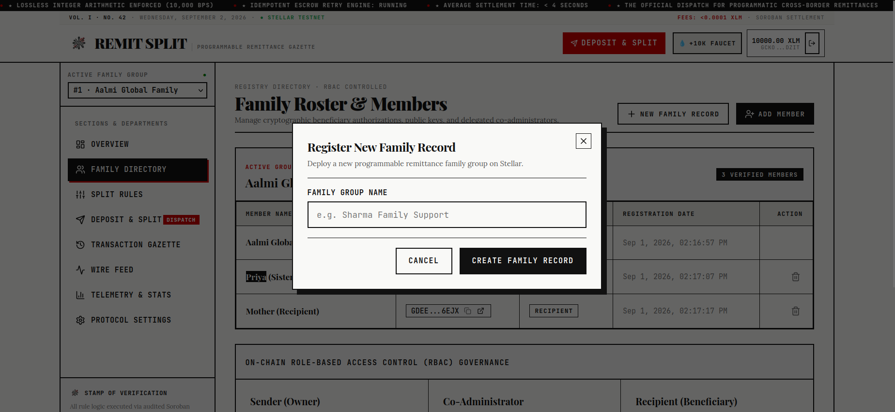 |

### 9.2 Mobile Responsive Views

| Mobile Hero & Telemetry | Mobile Split Strategies |
|:---:|:---:|
| 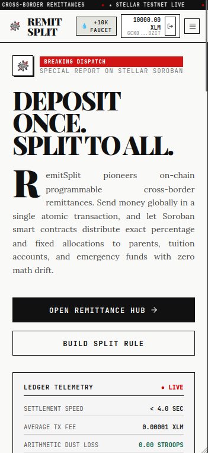 | 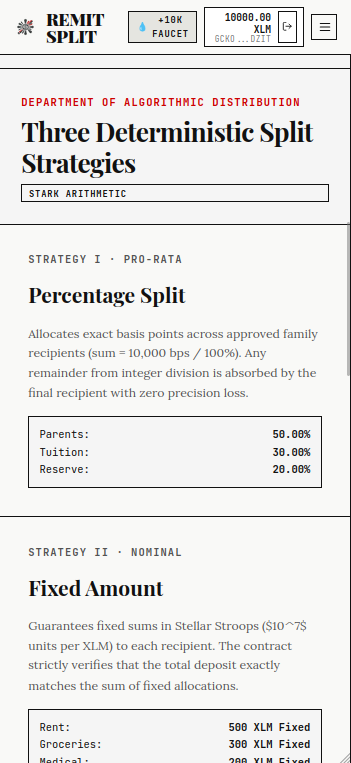 |

| Mobile Action Dispatch | Mobile Family Directory |
|:---:|:---:|
| 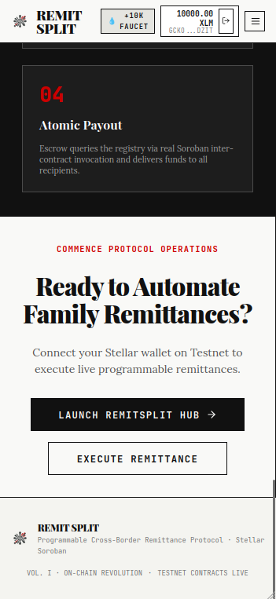 | 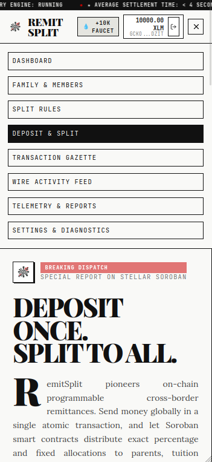 |

| Mobile RBAC Matrix | Mobile Overview Dashboard |
|:---:|:---:|
| 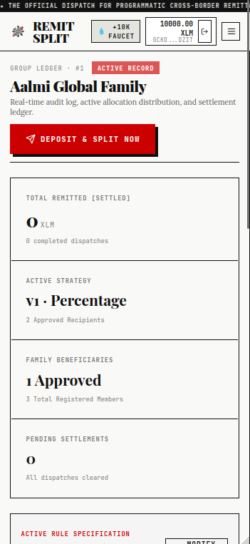 | 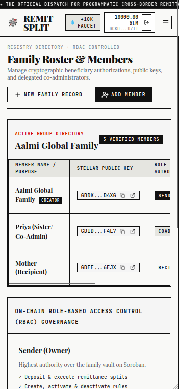 |

| Mobile Telemetry & Metrics | Mobile Rule Archive |
|:---:|:---:|
| 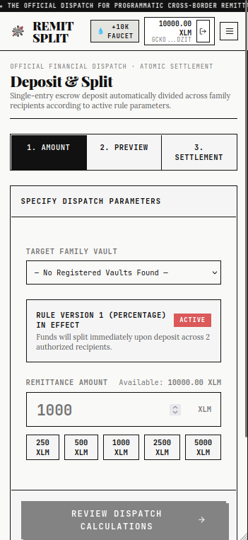 | 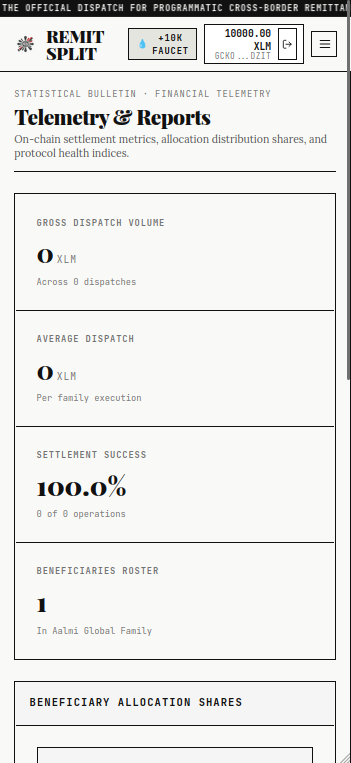 |

| Mobile Deposit & Split | Mobile Register Modal |
|:---:|:---:|
| 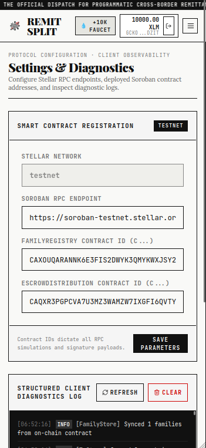 |  |

### 9.3 Test Execution Verification

| Rust Soroban Contract Tests (12/12 Passed) | Frontend Vitest Test Suite (20/20 Passed) |
|:---:|:---:|
| 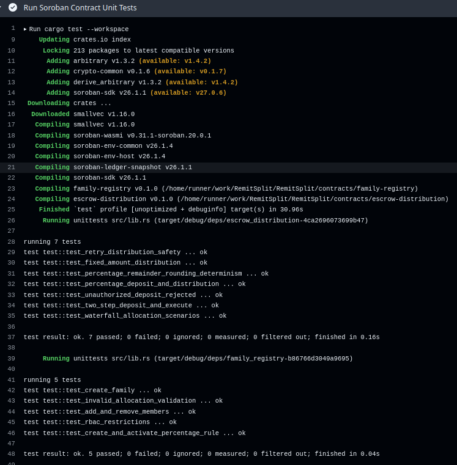 | 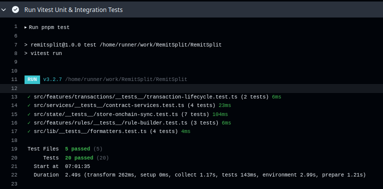 |

### 9.4 CI/CD Verification

| GitHub Actions Automated PR/Push Checks & Vercel Deployment (All 6 Passing) |
|:---:|
| 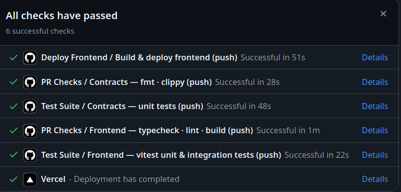 |

---

## 10. Contract Addresses & On-Chain Verification

### Testnet Deployments

| Component | Identifier / Address | Explorer Link |
|---|---|---|
| **Family Registry Contract** | `CASNMT6EHJFZHCVK3O7N253ANI3FG2AABPS7DT6QGWZRBKKFTVR5XC7V` | [View on StellarExpert](https://stellar.expert/explorer/testnet/contract/CASNMT6EHJFZHCVK3O7N253ANI3FG2AABPS7DT6QGWZRBKKFTVR5XC7V) |
| **Escrow Distribution Contract** | `CAQRTZ55VOZPSW5266EQVSAIRKRVZCEC4AIIRQOL3R7MAUNZXIFGS3YM` | [View on StellarExpert](https://stellar.expert/explorer/testnet/contract/CAQRTZ55VOZPSW5266EQVSAIRKRVZCEC4AIIRQOL3R7MAUNZXIFGS3YM) |
| **Native XLM SAC** | `CDLZFC3SYJYDZT7K67VZ75HPJVIEUVNIXF47ZG2FB2RMQQVU2HHGCYSC` | [View on StellarExpert](https://stellar.expert/explorer/testnet/contract/CDLZFC3SYJYDZT7K67VZ75HPJVIEUVNIXF47ZG2FB2RMQQVU2HHGCYSC) |

---

## 11. Resources & Links

- **Interactive Dapp**: [https://remitsplit.vercel.app](https://remitsplit.vercel.app)
- **Video Walkthrough**: `[Link to Video Demo Placeholder]`
- **Stellar Developer Portal**: [developers.stellar.org](https://developers.stellar.org)

---

## Contributing

Contributions are welcome! Please open an issue or submit a pull request adhering to our coding standards, clean architecture principles, and Conventional Commits format.

---

## License

MIT License &copy; 2026 RemitSplit Contributors.
